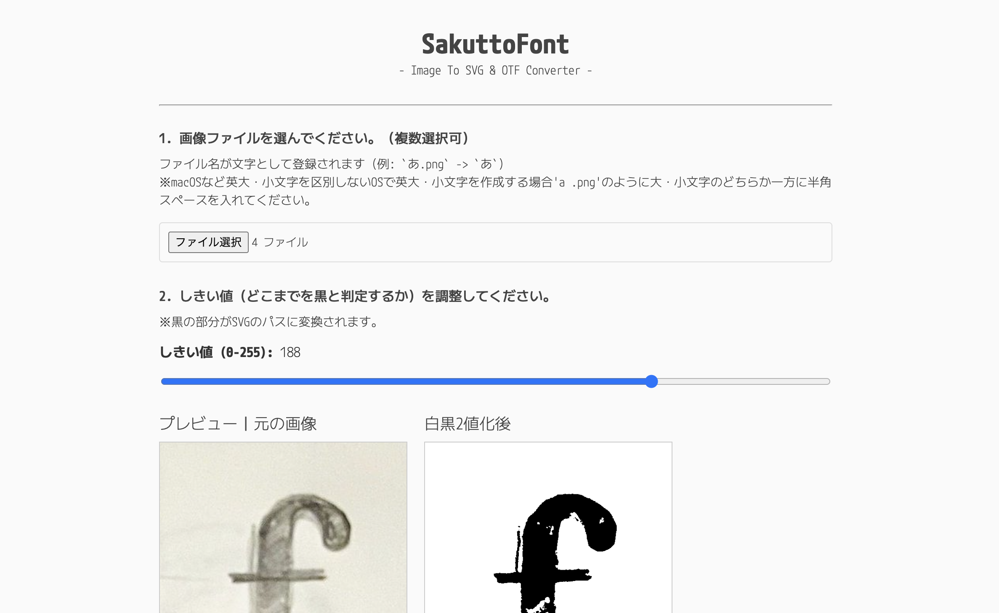

# SakuttoFont

**SakuttoFont** is a simple, in-browser tool that allows you to easily create custom SVG vector graphics and OTF font files from your images, such as hand-drawn letters or icons.

It runs entirely in your web browser without needing any software installation. All processing is done locally on your machine, meaning your images are never uploaded to a server.

## Features

*   **Image to Font Generation (OTF):**
    *   Convert multiple image files (PNG, JPG, etc.) into a single OpenType font file (`.otf`).
    *   The filename is automatically used as the character for the glyph (e.g., `A.png` becomes the letter 'A').
*   **Image to SVG Conversion:**
    *   Trace your images into high-quality vector graphics (`.svg`).
    *   Process multiple files at once and download them as a single `.zip` archive.
*   **Real-time Preview:**
    *   Adjust the black-and-white conversion "threshold" with a slider and see the results instantly.
*   **Japanese Font Support:**
    *   Automatically adds the necessary metadata (`meta` and `OS/2` tables) to ensure fonts containing Japanese characters (Hiragana, Katakana, Kanji) are correctly recognized by operating systems like Windows.
*   **Detailed Options:**
    *   Choose the output size for your SVGs.
    *   Select the character width for your font (monospace or proportional).

## How to Use

1.  **Select Image Files:**
    *   Click the "Choose Files" button and select one or more image files you want to convert.
    *   **(Important)** The filename should be the character you want to assign (e.g., `A.png`, `dog.png`, `!.png`).
2.  **Adjust the Threshold:**
    *   Use the "Threshold" slider while looking at the preview canvas to get a clean black-and-white representation of your image.
3.  **Choose SVG Size:**
    *   Select the desired output size for the vector. "Fix height to 1000px" is recommended for font generation.
4.  **Select an Action:**
    *   **To save as SVG:**
        *   Click the "Convert to SVG and Download" button.
    *   **To generate a font:**
        *   Enter a name for your font in the "Font Name" field.
        *   Choose a character width option (fixed or proportional).
        *   Click the "Generate Font and Download" button.

## Core Libraries

This tool is powered by these fantastic open-source libraries:

*   [**Potrace**](https://github.com/kilobtye/potrace) (JavaScript Port): The core engine for tracing bitmap images and converting them to vector paths.
*   [**opentype.js**](https://opentype.js.org/): A library for parsing, manipulating, and creating OpenType fonts.
*   [**JSZip**](https://stuk.github.io/jszip/): A library for creating, reading, and editing `.zip` files.

## License

This project inherits its license from its core dependency, [Potrace](https://github.com/kilobtye/potrace), and is therefore released under the **GNU General Public License v2.0 (GPL-2.0)**.

You can find the full text of the license in the [LICENSE](./LICENSE) file or at the link below:
*   [https://github.com/kilobtye/potrace/blob/master/COPYING](https://github.com/kilobtye/potrace/blob/master/COPYING)

This means that if you create and distribute a derivative work of this software, you must also make the source code available under the same GPL-2.0 license.

---

If you find this tool useful and want to show your support, consider purchasing [this article](https://note.com/toktaro/n/n220e71246bd7).
